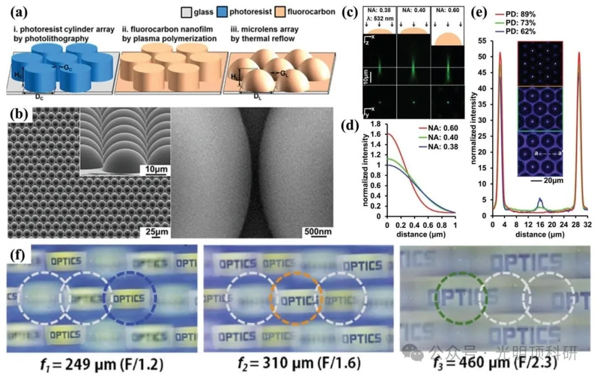
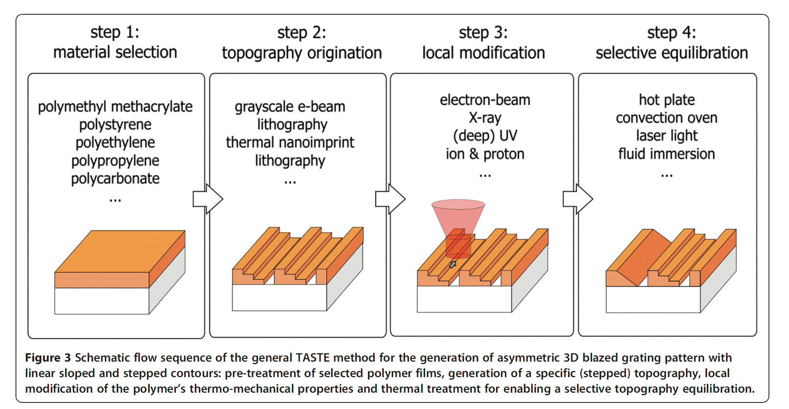
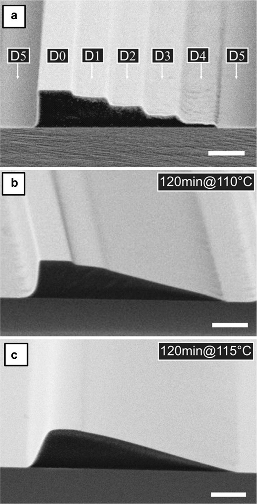

# 光刻胶回流法制备微结构

> 本文部分内容节选于： Bioinspired Artificial Compound Eyes: Characteristic,
> Fabrication, and Application。

## 技术特点

**光刻胶热回流法（photoresist thermal reflow method）是一种用于制备微透镜阵列（MLAs）的高效技术。**该方法主要利用光刻胶的热流变特性，通过特定的工艺步骤，将光刻胶图案转化为具有光学功能的微透镜结构。

## 应用场景

### **主要的制备步骤：**

1.  **光刻胶涂覆：**

-   将光刻胶均匀旋涂在清洁的基板（如玻璃或硅片）上。旋涂速度和时间控制光刻胶层的厚度。
  

> 相关研究表明，旋涂参数直接影响最终微透镜的尺寸和形状（参考文献：Lee, C.-C., et al. "Characterization of spin-coated photoresist layers for microlens
> fabrication." _Journal of Micromechanics and Microengineering_ 2002）。

   

2.  **掩模曝光和显影：**
    

-   使用带有圆形图案的掩模进行紫外线（UV）曝光。曝光能量和时间需精确控制，以确保图案完整转移。
    
-   曝光后，使用显影液去除未曝光区域的光刻胶，形成圆柱形阵列。
    

> 文献中指出，曝光和显影条件的优化对于确保圆柱形阵列的均匀性和质量至关重要（参考文献：Chen, H.-Y., et al.
> "Optimization of photolithographic parameters for microlens array
> fabrication." _Optical Engineering_ 2005）。

3.  **热回流：**
   
-   将基板加热至光刻胶的玻璃化转变温度（Tg）以上，此时光刻胶圆柱受表面张力影响，逐渐变形成光滑的球形结构。
    
-   热回流过程需要严格控制温度和时间，以避免光刻胶流动过度或不足。
    

> 研究显示，热回流温度和时间的选择对微透镜的曲率半径和光学性能有显著影响（参考文献：Tseng, S.-C., et al. "Thermal
> reflow process for microlens fabrication: effects on lens profile and
> optical performance." _Microelectronic Engineering_ 2008）。

## **TASTE 方法**

是对灰度结构选择性热回流效应的进一步发展和拓展。**之前的研究将灰度光刻和热回流相结合，用调制剂量的高能（100keV）电子对正性抗蚀剂进行局部曝光，显影后能得到有明显台阶的高度轮廓，再通过适度加热进行选择性回流，可将台阶结构转变为线性斜坡。**而 TASTE 在此基础上更进一步，它能在同一聚合物薄膜中生成几乎任意倾斜、凸凹的微纳尺度轮廓，为 3D 微纳制造带来了更多可能。**

 

<!--stackedit_data:
eyJoaXN0b3J5IjpbLTE0OTM2Njg0MTAsMTM1NDE0NjMxOSwtMj
Y3MTIwNTc5LC0xNTY1OTAzMjI4XX0=
-->